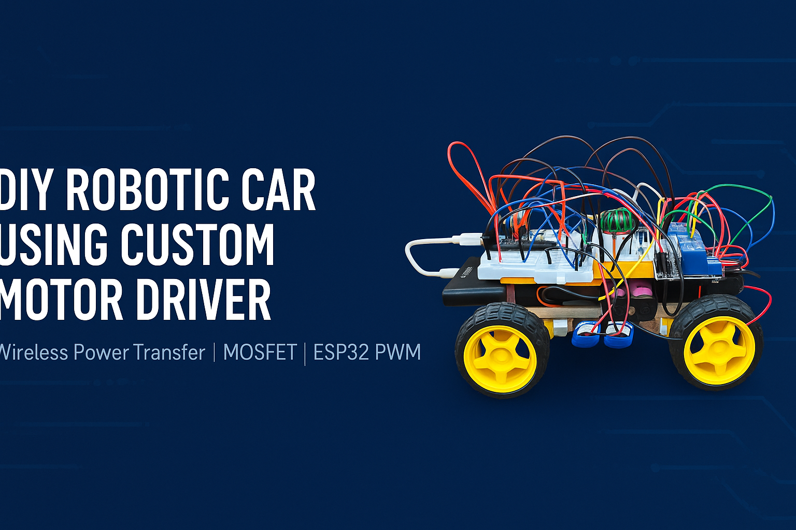
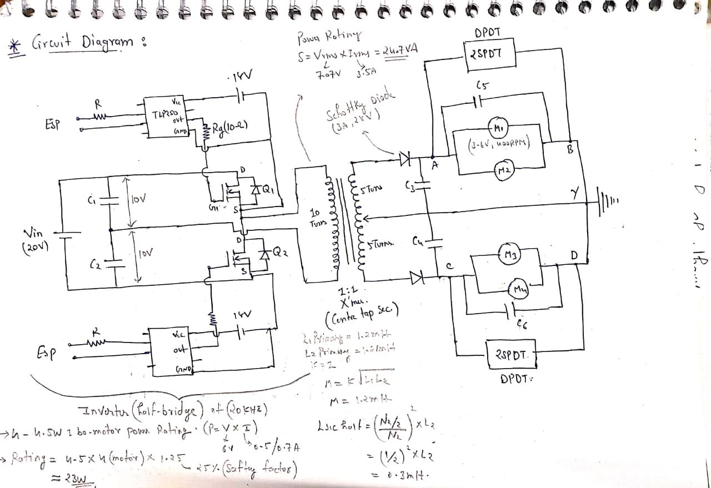
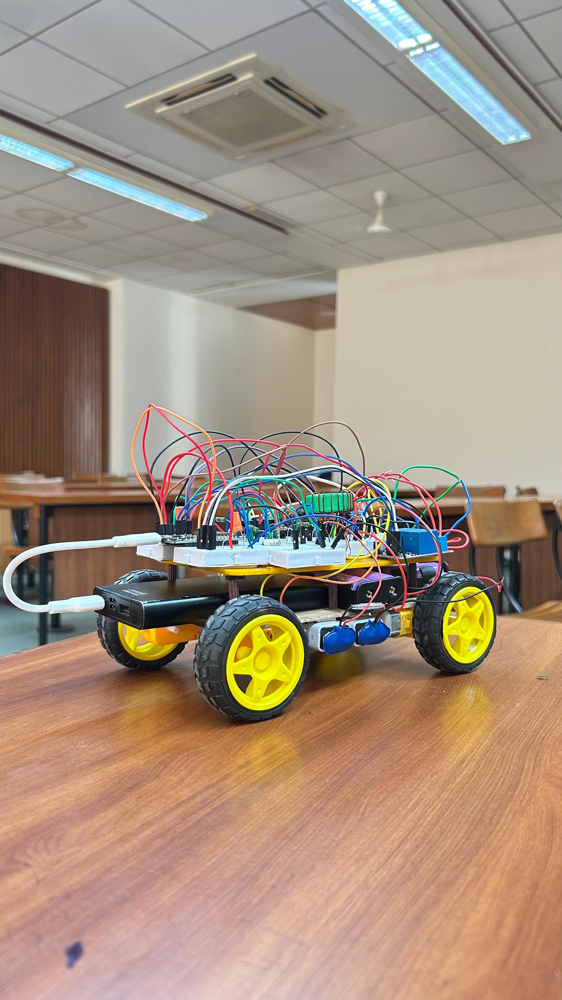
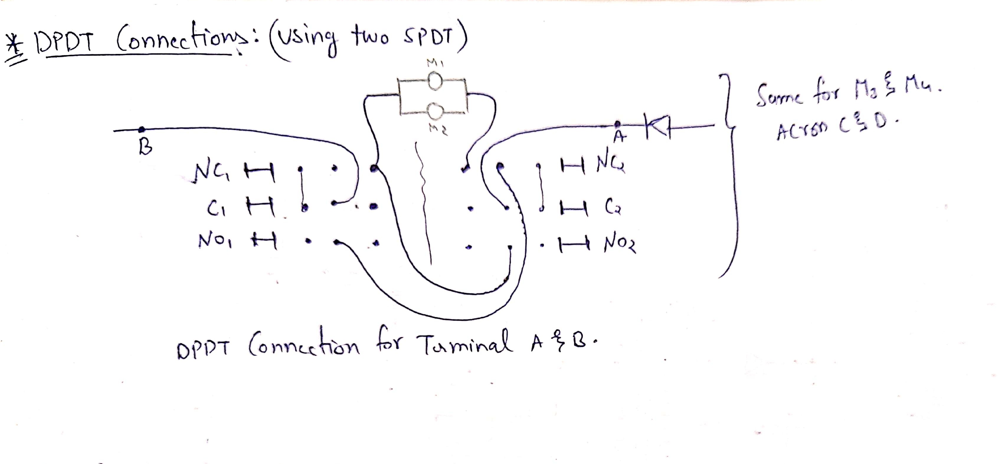
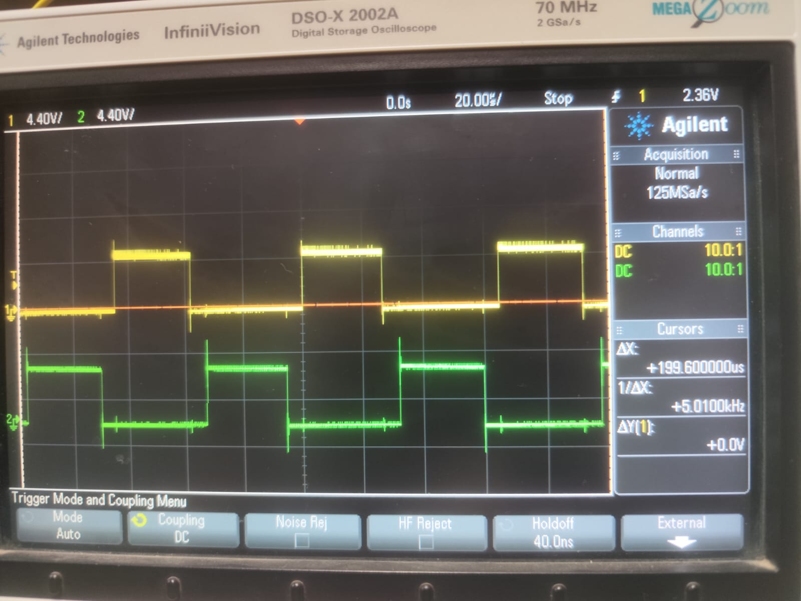

# 🚗 DIY Robotic Car Using Custom Motor Driver

This project is a fully working **DIY robotic car** built using a **custom-designed motor driver**, breadboard prototype electronics, relays, Li-ion battery pack, and a microcontroller for speed and direction control.

The car is completely hand-assembled and tested on a breadboard, making it a great learning project for embedded systems and motor control.

---

## 📘 Project Overview

### **Title of the Project**
**Design and Implementation of a Custom Motor Driver Using Power Electronics and Embedded Control**

### **Names and Enrollment Numbers**
- **[Your Name]** — *Enrollment No.: [Your Enrollment Number]*  
- *(Add teammates if applicable)*

---

## 🧠 Introduction

This project focuses on the design and development of a **custom motor driver circuit** using **power electronic components and embedded control**.  
The driver is based on a **half-bridge inverter topology**, which converts DC input voltage into a high-frequency AC signal to efficiently drive a motor load.  
It integrates **MOSFET switches**, **gate driver ICs**, and **microcontroller-based PWM control** to achieve precise speed and direction control.  

By combining hardware circuitry with software-based logic, the project demonstrates how **power electronics and embedded systems** can be used together to design an efficient and low-cost motor control solution suitable for robotics and automation applications.

---

## ⚙️ Circuit Diagram (Hand-drawn)

  

<strong>Figure 1 — Complete circuit diagram including inverter, transformer, rectifier, and motor driver.</strong>

---

## 🧩 List of Components and Specifications

| **Component** | **Specification / Rating** | **Description / Purpose** |
|----------------|-----------------------------|----------------------------|
| MOSFETs (Q1, Q2) | IRF540N (100 V, 33 A, Rds(on)=0.077 Ω) | Half-bridge switching devices |
| Gate Driver IC | IR2110 | High- and low-side MOSFET driver |
| Transformer | 10 T primary : 5 T secondary | Provides isolation and voltage step-down |
| Diodes | Schottky Diodes (3 A, 20 V) | Fast recovery diodes for rectification |
| Capacitors (C1–C5) | 470 µF / 25 V electrolytic | DC bus and output filtering |
| Resistors | 10 Ω, 1 kΩ | Current limiting and biasing |
| Microcontroller | Arduino / ESP32 | Provides PWM control at 20 kHz |
| Power Supply | 20 V DC input | Main input voltage source |
| Load | DC Motor / RL Load | Output motor load |
| SPDT/DPDT Switch | – | Direction and mode control |

---

## 📊 Discussion on Output

The circuit functions as a **half-bridge inverter**, converting a **20 V DC** input into an alternating signal to drive the motor.  
MOSFETs switch at **20 kHz**, controlled by PWM signals from the microcontroller through the IR2110 driver.  

- The transformer provides **isolation and voltage adjustment**.  
- Schottky diodes and capacitors smooth the output waveform.  
- The DPDT relay arrangement enables **bidirectional control** of the motor.  
- The inverter delivers about **32 W** of power based on measured voltage and current.  
- The output waveform observed on the oscilloscope confirms **proper switching operation and motor speed control**.

The system demonstrates stable performance, low switching loss, and reliable motor control through combined hardware and software integration.

---

## 📸 Project Photo

  

<strong>Figure 2 — Prototype robotic car with custom motor driver and Li-ion battery pack.</strong>

---

## 📷 Photo Gallery

### 🖥️ Serial Bluetooth Terminal Output

  

<strong>Figure 3 — Serial Bluetooth Terminal showing real-time command logs (LEFT, RIGHT, REVERSE, STOP).</strong>

---

### 📐 DPDT / SPDT Motor Switching Diagram

  

<strong>Figure 4 — DPDT motor direction switching diagram (implemented using two SPDT relays).</strong>

---

### 🔬 Inverter Output Waveform (Oscilloscope)

  

<strong>Figure 5 — Oscilloscope waveform showing custom driver switching pattern.</strong>

---

## 🔧 Features

- Custom MOSFET-based motor driver  
- Dual-motor control (forward & reverse)  
- Relay switching and protection  
- Li-ion battery pack for portable power  
- ESP32/Arduino microcontroller control  
- Breadboard prototype wiring  
- PWM-based motor speed control  
- Compact lightweight chassis  
- Expandable for sensors (ultrasonic, IR, Bluetooth)  

---

## 🧩 Hardware Used

- 2× DC gear motors with wheels  
- Custom motor driver (homemade)  
- ESP32 / Arduino  
- Breadboards  
- Jumper wires  
- Relays  
- Li-ion batteries  
- Battery holder and connectors  
- Switches, diodes, resistors, capacitors  

---

## ⚙️ How It Works

1. The microcontroller generates **PWM signals** to drive the motor through the custom power circuit.  
2. The inverter stage switches at **20 kHz**, producing an alternating voltage across the transformer.  
3. The secondary output drives the motor via **rectification and relay-based direction control**.  
4. The Li-ion battery pack powers the entire circuit.  
5. The car moves **forward, reverse, left, or right** based on received Bluetooth commands.  

---

## 📄 License

This project is released under the **MIT License**.

---
